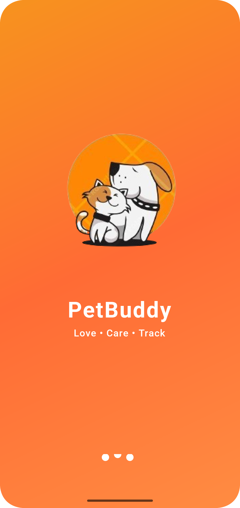
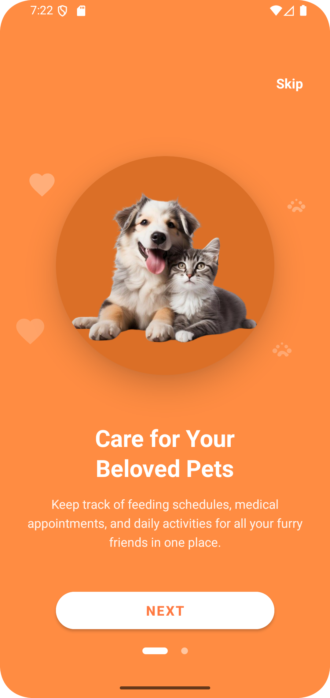
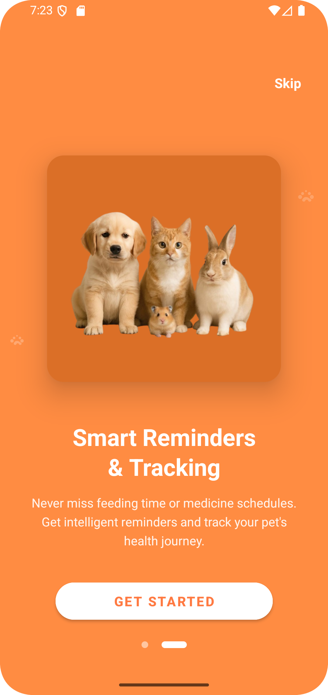
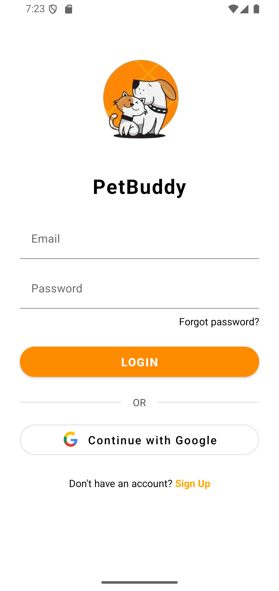
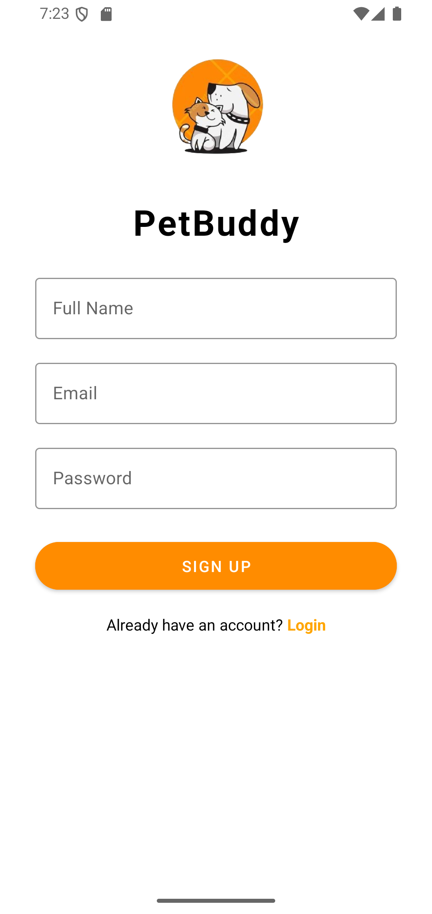

#  PetBuddy – Pet Care App

PetBuddy is a mobile application designed to help pet owners **love, care, and track** their pets’ daily needs.  
The app provides an easy way to manage pet health, feeding schedules, walking routines, medicines, and vet appointments – all in one place.  

  
  
  

  
  

---

##  Core Features

### 1. **Launch Screen**
- Displays app logo and tagline: *Love • Care • Track*.  
- Creates a warm and friendly first impression with a pet-focused theme.

### 2. **Onboarding Screens (1 & 2)**
- Introduces the app to new users with simple illustrations and text.  
- Highlights benefits like easy pet management, scheduling, and reminders.  

### 3. **Login Screen**
- Allows existing users to log in securely with email/Google authentication.  

### 4. **Signup Screen**
- New users can create an account by providing basic details.  
- Ensures personalization and better pet record management.  

### 5. **Home Screen (Dashboard)**
- Displays greeting message and quick overview of tasks.  
- Shows pets list with health status.  
- Quick access to add/edit pets.  

---

##  Other Functional Screens (Purpose)

###  Feeding Screen
- Set **feeding schedules** based on each pet.  
- Notifications/reminders for feeding times.  

###  Walking Screen
- Schedule **walking activities** for each pet.  
- Track walking frequency and duration.  

###  Medicine Screen
- Schedule **medicine reminders**.  
- Ensure pets take medicines on time.  

###  Vet Care Screen
- Find **nearby veterinary clinics**.  
- **Book appointments** directly.  
- View and manage **upcoming appointments**.  
- Contact **emergency vet** quickly.  
- Save and call **regular vet** easily.  

---

##  UI/UX Design

I designed the **PetBuddy UI** with a clean, friendly, and modern layout:  
- **Splash/Onboarding** with playful pet illustration to connect emotionally with users.  
- **Home screen cards** for quick glance of pets and health status.  
- Rounded corners and shadows for a soft and friendly look.  
- Icons and illustrations to make navigation simple and engaging.  

---

##  Target Audience

- **Pet owners** (cats, dogs, rabbits, etc.) who want to keep track of their pets.  
- Busy individuals who need **reminders** for feeding, walking, or medicine.  
- Families who want to **share pet responsibilities**.  
- Pet lovers who want to **easily connect with vets**.  

---

##  Color Palette

- **Primary:** Gradient Orange (#FF9800 → #FF5722) – warmth, energy, friendliness.  
- **Secondary:** Green (#4CAF50) – used for healthy status.  
- **Accent:** Purple (#7E57C2) – for highlights like “View All”.  
- **Neutral:** White & light backgrounds for clean readability.  

This **60-30-10 color principle** was followed:  
- 60% Orange (primary background & headers)  
- 30% White/Neutral (cards, layouts)  
- 10% Accent (green, purple for highlights/status)  

---

##  Conclusion

PetBuddy helps pet owners manage their pets with **love, care, and efficiency**.  
By combining **clean UI design, scheduling features, and vet connectivity**, it makes pet parenting easier and stress-free.  

---
